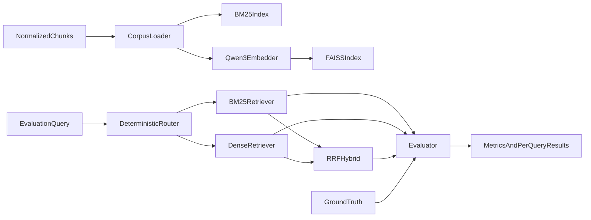

# CS-46 Embedding and Retrieval Evaluation Design

**Project:** Evidence-Grounded Scientific RAG Assistant with Citation and Quality Evaluation for Drug Discovery
**Document version:** v1.1
**Date:** 2026-09-21
**Scope:** Sparse, dense, and hybrid retrieval over normalized chunks; retrieval-only evaluation

---

## 1. Purpose

This document defines the CS-46 retrieval-stage design after corpus chunking. The stage compares three retrieval methods over the same corpus:

1. **Sparse retrieval:** BM25
2. **Dense retrieval:** Qwen3-Embedding-0.6B with FAISS
3. **Hybrid retrieval:** BM25 and dense candidate fusion using Reciprocal Rank Fusion (RRF)

The evaluation covers retrieval quality, latency, index build time, and index size. It does **not** evaluate answer generation, citation wording, or LLM factuality.

---

## 2. Inputs and Boundaries

### 2.1 Indexed Inputs

The source of truth is `artifacts/manifest.json`. The current corpus contains four normalized JSONL files:

| Collection | Artifact | Chunks |
|---|---|---:|
| `gene_info` | `artifacts/chunks/gene_info.chunks.jsonl` | 24,825 |
| `ldsc_genetic_correlation` | `artifacts/chunks/ldsc_2hrI.chunks.jsonl` | 781 |
| `gene_association_common` | `artifacts/chunks/gene_association_common_2hrG.chunks.jsonl` | 11,383 |
| `gene_association_rare` | `artifacts/chunks/gene_association_rare_2hrG.chunks.jsonl` | 4,114 |
| **Total** | | **41,103** |

The optional LDSC summary described in the chunking design is not present in the current manifest and is excluded from this experiment.

### 2.2 Indexed Fields

Each retrieval record keeps the complete normalized chunk envelope:

- `chunk_id`: canonical result identifier and evaluation key
- `collection`: routing and filtering
- `entity_type`: routing and filtering
- `title`: indexed text
- `content`: indexed text and dense embedding input
- `metadata`: exact filters and result inspection
- `citation`: provenance returned with the result, but not used for ranking

The production-oriented comparison uses each method's intended representation: BM25 indexes `title + "\n" + content`, while dense retrieval embeds `content` only, matching the chunking specification. Because this field difference can affect quality, the report also includes a **field-matched diagnostic** in which BM25 indexes `content` only. Conclusions must distinguish method-native results from this diagnostic rather than attributing all differences to the ranking algorithm.

### 2.3 Exclusions

- `data/raw/reference/gene_id_map/genes.jsonl` is not indexed.
- Different evidence collections are not merged into new chunks.
- Raw JSON/JSONL source records are not embedded.
- Metadata values do not silently alter retrieval scores. Any metadata filter must be explicit and logged.
- Reranking and answer generation are outside the MVP experiment.

---

## 3. Architecture



All three methods use the same loaded records, router decision, allowed collections, metadata filters, requested `top_k`, and result schema.

### 3.1 Common Retriever Contract

Conceptual interface:

```python
search(
    query: str,
    top_k: int,
    collections: list[str] | None = None,
    filters: dict | None = None,
) -> list[SearchResult]
```

Each `SearchResult` contains:

| Field | Description |
|---|---|
| `chunk_id` | Globally unique chunk identifier |
| `collection` | Source collection |
| `rank` | Final 1-based rank |
| `score` | Method-specific score |
| `method` | `bm25`, `dense`, or `hybrid_rrf` |
| `component_scores` | Sparse/dense scores and ranks when available |
| `chunk` | Original normalized chunk envelope |

Scores are not compared across methods because BM25, cosine similarity, and RRF use different scales.

---

## 4. Query Routing and Filtering

Routing must be identical for all methods. The router uses deterministic query signals and never uses the expected answer or expected `chunk_id`.

| Query intent | Allowed collection |
|---|---|
| Gene function, coordinates, aliases, or database identifiers without association intent | `gene_info` |
| LDSC, genetic correlation, `2hrI`, trait-versus-trait wording | `ldsc_genetic_correlation` |
| Explicit common variant, GWAS, or `bf_common` intent | `gene_association_common` |
| Explicit rare variant, gene-based test, `bf_rare`, or rare association intent | `gene_association_rare` |
| Gene with `2hrG` association intent but no variant class | Both gene-association collections |
| Explicit common-and-rare comparison | Both gene-association collections |
| Ambiguous or unmatched query | All four collections |

Intent rules take precedence over isolated entity matches: a gene symbol inside an association question does not independently route the query to `gene_info`. If multiple intent rules still match, the router returns the union of their collections. Every evaluation result records the matched rules and final router output.

Two views are reported:

1. **Primary — routed retrieval:** measures the intended retrieval pipeline.
2. **Diagnostic — oracle-collection retrieval:** uses the benchmark's target collection only to separate retrieval errors from routing errors.

The diagnostic view must not replace the primary result.

---

## 5. Sparse Retrieval: BM25

### 5.1 Index Text

```text
{title}
{content}
```

The chunk remains the retrieval unit. No passage re-splitting is performed.

### 5.2 Tokenization

The baseline tokenizer must be deterministic and preserve biomedical identifiers:

- Unicode normalization: NFKC
- Case normalization: lowercase
- Keep alphanumeric identifiers and internal `.`, `_`, `-`, and `:`
- Treat surrounding punctuation and whitespace as separators
- Do not stem
- Do not remove stop words in the baseline

Examples that must remain searchable include `tcf7l2`, `ensg00000148737`, `2hri`, `2hrg`, `ac004233.4`, and `ldsc:2hri:t2d`.

The implementation must test identifier tokenization explicitly. Any later stemming, synonym expansion, character n-grams, or metadata-field boosting is a separate experiment rather than an unreported baseline change.

### 5.3 BM25 Configuration

Use one fixed BM25 implementation and record:

- library and exact version
- BM25 variant
- `k1` and `b`
- tokenizer configuration
- corpus document count and average document length

The initial baseline uses the library's standard BM25 defaults. Parameter changes may be selected on the development set only.

### 5.4 Persistence

Persist:

- tokenized corpus or reproducible tokenization inputs
- BM25 model state
- integer document position to `chunk_id` mapping
- configuration and corpus-manifest hash

---

## 6. Dense Retrieval: Qwen3-Embedding-0.6B

### 6.1 Model Configuration

| Setting | MVP value |
|---|---|
| Model | `Qwen/Qwen3-Embedding-0.6B` |
| Default embedding dimension | 1,024 |
| Dimension reduction | Disabled |
| Maximum model sequence length | 32K tokens |
| Document instruction | None |
| Query instruction | Model-provided `query` prompt |
| Vector normalization | L2 normalization |
| Similarity | Inner product over normalized vectors |
| FAISS index | `IndexFlatIP` |

Qwen3-Embedding supports query instructions and Matryoshka Representation Learning (MRL). The MVP keeps the full 1,024 dimensions so dimension reduction does not become an uncontrolled experimental variable.

Documents are encoded without a prompt. Queries are encoded with the model's retrieval query prompt, following the official usage:

```python
document_embeddings = model.encode(documents, normalize_embeddings=True)
query_embeddings = model.encode(
    queries,
    prompt_name="query",
    normalize_embeddings=True,
)
```

The implementation must pin and record the model revision because a model name alone does not guarantee reproducibility.

### 6.2 FAISS Index Choice

The corpus has 41,103 vectors. `IndexFlatIP` performs exact search and avoids approximate-index recall becoming a confounding variable. At 1,024 dimensions, raw float32 vectors require approximately 161 MiB before mappings and metadata.

Approximate indexes such as HNSW or IVF are deferred until corpus scale or latency requires them. They must be evaluated separately against the exact index.

### 6.3 Encoding and Persistence

The index builder:

1. Loads and validates all four JSONL artifacts.
2. Encodes `content` in batches.
3. Converts vectors to float32 and L2-normalizes them.
4. Adds vectors to FAISS in deterministic corpus order.
5. Saves the FAISS index and position-to-`chunk_id` mapping.
6. Saves the model revision, embedding dimension, normalization flag, device, dtype, batch size, package versions, and source manifest hash.

GPU may accelerate index building, but the resulting index is persisted as a CPU-readable FAISS index. CPU and GPU timing results must not be mixed.

---

## 7. Hybrid Retrieval: Reciprocal Rank Fusion

BM25 and dense retrieval each return their top `candidate_k` results after applying the same routing constraints. RRF merges the union:

```text
RRF(d) = Σ_m weight_m / (rrf_k + rank_m(d))
```

where:

- `m` is BM25 or dense retrieval
- `rank_m(d)` is the 1-based rank of document `d`
- a missing document contributes zero for that method
- baseline `weight_bm25 = 1.0`
- baseline `weight_dense = 1.0`
- baseline `rrf_k = 60`
- baseline `candidate_k = 50`

Ties are resolved deterministically by:

1. higher RRF score
2. better best component rank
3. lexical `chunk_id`

Only the development set may be used to compare a small predefined grid of weights, `rrf_k`, or `candidate_k`. The selected configuration is frozen before test-set evaluation. Raw BM25 and dense component ranks are retained for error analysis.

---

## 8. Evaluation Dataset

### 8.1 Dataset Split

The benchmark contains two separately stored files:

- **Development set:** 20 queries for tokenizer checks, routing validation, threshold calibration, and hybrid configuration selection
- **Test set:** 100 frozen queries for final reporting

The test set must not be inspected to tune retrieval parameters.

### 8.2 Test Query Distribution

| Query type | Count | Primary target |
|---|---:|---|
| Gene function, alias, identifier, or genomic location | 25 | `gene_info` |
| LDSC trait correlation | 20 | `ldsc_genetic_correlation` |
| Common-variant gene association | 20 | `gene_association_common` |
| Rare-variant gene association | 15 | `gene_association_rare` |
| Cross-collection or multiple-relevant-chunk query | 10 | Two or more collections/chunks |
| Out-of-corpus or unanswerable query | 10 | No relevant chunks |
| **Total** | **100** | |

Across answerable queries, target approximately:

- 35 easy queries: exact identifiers or near-verbatim wording
- 40 medium queries: natural-language paraphrases and aliases
- 15 hard queries: indirect wording, ambiguity, or multiple relevant chunks

The 10 unanswerable queries are reported separately and are not assigned artificial relevant chunks.

### 8.3 Benchmark Record Schema

Each line is one JSON object:

```json
{
  "query_id": "test-gene-001",
  "query": "Which gene is identified by ENSG00000148737?",
  "query_type": "gene_identifier",
  "difficulty": "easy",
  "target_collections": ["gene_info"],
  "assessed_chunk_ids": ["gene:TCF7L2"],
  "relevance_judgments": [
    {
      "chunk_id": "gene:TCF7L2",
      "grade": 2
    }
  ],
  "answerable": true,
  "notes": "Direct Ensembl identifier lookup"
}
```

Relevance grades:

- `2`: directly answers the retrieval need
- `1`: useful supporting evidence but not sufficient alone
- `0`: reviewed but not relevant

For the finalized pooled benchmark, every reviewed candidate is recorded in
`relevance_judgments` with an explicit grade of `0`, `1`, or `2`. The same
candidate IDs are retained in `assessed_chunk_ids` to record the full reviewed
pool. Therefore, grade `0` means explicitly judged non-relevant; an absent
candidate is not treated as an automatically judged negative.

Binary Recall and MRR treat grade `2` as relevant. nDCG uses grades `0–2`.

### 8.4 Ground-Truth Construction

1. Select target chunks from all four collections and across evidence-quality levels.
2. Write queries from the chunk evidence, including exact lookup and natural paraphrases.
3. Add hard negatives with similar gene names, shared phenotype terms, or the wrong evidence class.
4. Run all three retrievers and pool at least their top-10 candidates for each query.
5. Judge every pooled candidate so additional relevant chunks are not incorrectly treated as negatives; add every reviewed candidate to `assessed_chunk_ids`.
6. Verify every judged `chunk_id` exists in the current manifest-backed artifacts.
7. Have a second reviewer inspect all hard, multi-relevant, disputed, and unanswerable queries.
8. Freeze the completed judgments and test file, then record the file's SHA-256 hash before final experiments.

Queries must not claim evidence absent from the chunk. LDSC, common-variant, rare-variant, and gene-function evidence remain semantically distinct.

If pooled judging is not completed, report `TargetHit@k` and target reciprocal rank instead of claiming corpus-level Recall or nDCG.

---

## 9. Metrics

### 9.1 Retrieval Quality

Report:

- `Recall@1`, `Recall@3`, `Recall@5`, `Recall@10`
- `MRR@10`
- `nDCG@10`
- router exact-set accuracy, collection precision, and collection recall

For a query with one or more grade-2 chunks:

```text
Recall@k = retrieved grade-2 chunks in top-k / all judged grade-2 chunks
MRR@10 = 1 / rank of first grade-2 chunk, or 0 if absent
```

nDCG@10 uses the graded judgments and normalizes DCG by the ideal ranking for each query.

For routing, compare the predicted collection set `P` with `target_collections` set `T`:

```text
exact-set accuracy = mean(P == T)
collection precision = |P ∩ T| / |P|
collection recall = |P ∩ T| / |T|
```

Collection precision and recall are macro-averaged across queries. Unanswerable queries are excluded from router metrics because they have no target collection.

Metrics are reported:

1. overall for answerable queries
2. by query type
3. by collection
4. by difficulty
5. for routed and oracle-collection diagnostic retrieval

### 9.2 Unanswerable Queries

A retriever always returns nearest candidates unless an abstention threshold is introduced. Therefore unanswerable-query evaluation uses a method-specific confidence threshold selected on the development set.

Confidence is the top-1 BM25 score, top-1 dense cosine similarity, or top-1 hybrid RRF score. For each method, choose the threshold that maximizes balanced accuracy on the development set subject to an answerable-query false-negative rate no greater than 10%. If no threshold satisfies the constraint, choose the threshold with the lowest false-negative rate; break ties by lower false-positive rate and then by the lower threshold. Record all candidate thresholds and development-set outcomes.

Report:

- false-positive rate: fraction of unanswerable test queries accepted as answerable
- answerable-query false-negative rate
- coverage: fraction of all queries accepted

Threshold scores are not compared numerically across methods. Results without a calibrated threshold must be labelled “forced retrieval” and must not claim abstention capability.

### 9.3 Efficiency

Report on the same machine and process settings:

- document encoding time
- index build time
- serialized index size
- cold-start load time
- search-only latency
- end-to-end query latency, including query embedding
- median, p95, and mean latency

The current final test reruns recorded the following retrieval latency and
serialized index sizes:

| Method | Mean latency (s) | Median latency (s) | P95 latency (s) | Serialized index size |
|---|---:|---:|---:|---:|
| BM25 | 0.0409 | 0.0334 | 0.0993 | 33.61 MiB |
| Dense | 0.1596 | 0.1361 | 0.1579 | 163.85 MiB |
| Hybrid | 0.2214 | 0.1954 | 0.2807 | 197.46 MiB (BM25 + dense) |

Document encoding time, index build time, cold-start load time, and separately
isolated search-only versus end-to-end latency were not recorded in these
runs. The detailed machine-readable summary is stored at
`artifacts/evaluation/performance/performance_summary.json`.

Run one warm-up pass, then at least five measured passes over the full query set. Report CPU/GPU model, RAM/VRAM, thread count, software versions, batch size, and whether caches are warm.

---

## 10. Experimental Protocol

1. Validate artifact counts against `artifacts/manifest.json`, compute SHA-256 for each chunk artifact, and save those hashes in the experiment snapshot. The current manifest records source hashes but not output-chunk hashes.
2. Build BM25 and dense indexes once from the same ordered corpus.
3. Run automated schema, identifier-tokenization, index-mapping, and deterministic-ranking tests.
4. Use the development set to finalize routing, BM25 parameters, hybrid parameters, and optional confidence thresholds.
5. Freeze configuration, model revision, and test-set hash.
6. Run BM25, dense, and hybrid retrieval with identical routing and `top_k`.
7. Save every ranked result before aggregating metrics.
8. Generate overall and sliced reports.
9. Perform error analysis using fixed categories:
   - routing failure
   - identifier/tokenization failure
   - semantic mismatch
   - wrong evidence class
   - near-duplicate competition
   - missing or incorrect relevance judgment

### 10.1 Fairness Rules

- No method receives extra metadata or synonym expansion unavailable to the others unless reported as a separate experiment.
- Report the BM25 `title + content` production representation and the `content`-only field-matched diagnostic separately.
- No test query is used for parameter selection.
- The primary comparison uses the same `top_k` values and corpus snapshot.
- Dense timing is reported both with and without query encoding.
- Hybrid timing includes both component searches and fusion.
- A changed chunk file or model revision requires index rebuild and a new experiment identifier.

### 10.2 Final 100-Query Test Results

The finalized test benchmark contains 100 unique queries. The three methods
were evaluated with the same benchmark snapshot and the same top-k values.
The benchmark hash is:

```text
SHA-256: dd418debec143c33233db4c2a5b1986274ff72cbbf84574e34c3e7dc370b1f1f
```

The current benchmark contains 90 answerable and 10 unanswerable queries. Its
difficulty distribution is 31 easy, 43 medium, and 26 hard queries. The
relevance labels contain 100 grade-2 judgments and no grade-1 judgments in
the completed conservative annotation pass.

All 10 unanswerable queries now contain the pooled candidates returned by the
three retrievers in `assessed_chunk_ids`; these candidates are judged as
grade 0, and none is assigned grade 2.

| Method | TargetHit@10 | Recall@10 | nDCG@10 | MRR@10 |
|---|---:|---:|---:|---:|
| BM25 | 0.870 | 0.870 | **0.8445** | **0.8350** |
| Dense | 0.820 | 0.780 | 0.7137 | 0.7169 |
| Hybrid (RRF) | **0.880** | **0.880** | 0.8272 | 0.8195 |

The final result indicates that hybrid retrieval provides the strongest
top-10 recall, while BM25 provides the strongest ranking quality according to
nDCG@10 and MRR@10. Dense retrieval alone is lower on all four reported
metrics for this benchmark. These results are retrieval-only results and do
not evaluate answer generation or citation correctness.

The completed first-pass manual audit covered all 100 benchmark queries. Each
query was checked against its target chunk and retrieved candidates; the audit
decisions are recorded in
`data/evaluation/manual_review_decisions.jsonl`. The final benchmark uses a
conservative 0/2 annotation: no candidate required a grade-1 partial-
relevance label.

The final outputs are stored in:

- `artifacts/evaluation/bm25_test/`
- `artifacts/evaluation/dense_test/`
- `artifacts/evaluation/hybrid_test/`

Each directory contains results for all 100 queries and records the same
test-set SHA-256 and corpus chunk hashes.

### 10.3 Sliced Findings

The evaluator also reports results by query type. The most relevant Recall@10
and nDCG@10 results are:

| Query type | BM25 Recall@10 | Dense Recall@10 | Hybrid Recall@10 | BM25 nDCG@10 | Dense nDCG@10 | Hybrid nDCG@10 |
|---|---:|---:|---:|---:|---:|---:|
| Common association | 1.000 | 0.950 | 0.950 | 0.9678 | 0.8908 | 0.9500 |
| Cross-collection | 1.000 | 0.500 | 1.000 | 0.9571 | 0.5169 | 0.9265 |
| Gene alias | 1.000 | 0.833 | 1.000 | 1.0000 | 0.7718 | 1.0000 |
| Gene function | 1.000 | 1.000 | 1.000 | 1.0000 | 0.9421 | 1.0000 |
| Gene identifier | 1.000 | 0.500 | 1.000 | 1.0000 | 0.5000 | 1.0000 |
| Gene location | 1.000 | 0.500 | 1.000 | 1.0000 | 0.5000 | 0.8155 |
| LDSC correlation | 0.900 | 0.900 | 1.000 | 0.8262 | 0.6996 | 0.7911 |
| Rare association | 0.933 | 0.933 | 0.933 | 0.9333 | 0.9087 | 0.9333 |

The main error-analysis priorities are cross-collection retrieval, LDSC
correlation, gene identifier, and gene location queries. Hybrid recovers all
judged targets at top-10 for these categories, but its nDCG is lower than BM25
on cross-collection queries, indicating that some relevant chunks are
retrieved later in the ranking. Dense retrieval is particularly weaker on
cross-collection, identifier, and location queries. The router itself achieved
0.97 exact-set accuracy, 0.9783 collection precision, and 1.00 collection
recall on this test run.

Unanswerable queries are currently reported under forced retrieval. Their zero
retrieval-quality scores do not measure abstention quality; a calibrated
confidence threshold is still required before false-positive rate and coverage
can be reported.

---

## 11. Configuration and Artifacts

Recommended implementation layout:

```text
config/
  retrieval.yaml
data/evaluation/
  retrieval_dev.jsonl
  retrieval_test.jsonl
src/retrieval/
  schema.py
  corpus.py
  router.py
  bm25_retriever.py
  dense_retriever.py
  hybrid_retriever.py
  metrics.py
scripts/
  build_retrieval_indexes.py
  evaluate_retrieval.py
tests/
  test_retrieval.py
artifacts/
  indexes/
  evaluation/
```

`config/retrieval.yaml` should be the single source of truth for:

- chunk artifact paths
- indexed fields and tokenizer settings
- model name and pinned revision
- embedding dimension and normalization
- FAISS index type
- BM25 parameters
- router rules
- `candidate_k`, `rrf_k`, and fusion weights
- reported `top_k` values
- benchmark paths and random seed

Each experiment writes:

```text
artifacts/evaluation/{experiment_id}/
  config.snapshot.yaml
  environment.json
  corpus_manifest.snapshot.json
  chunk_hashes.json
  per_query_results.jsonl
  metrics.json
  report.md
```

Indexes are written under `artifacts/indexes/{index_id}/` with their mappings and build metadata. Generated indexes and model caches should not be committed unless explicitly required.

---

## 12. Validation and Acceptance Criteria

### 12.1 Index Validation

- Exactly 41,103 unique `chunk_id` values are loaded.
- Collection counts match `artifacts/manifest.json`.
- SHA-256 is recorded for each of the four chunk artifacts and incorporated into the index identifier.
- FAISS vector count equals the document mapping count.
- All dense vectors have dimension 1,024 and finite values.
- Saved and reloaded indexes return identical top results for a fixed smoke-test query set.
- Required identifiers survive BM25 tokenization.
- A filter never returns a chunk outside its allowed collection.

### 12.2 Benchmark Validation

- Query IDs are unique.
- All query types and difficulty values belong to declared enums.
- Every judged `chunk_id` exists in the indexed corpus.
- Every pooled top-10 candidate appears in `assessed_chunk_ids` before Recall or nDCG is reported.
- Answerable queries contain at least one grade-2 judgment.
- Unanswerable queries contain no positive relevance judgments but retain reviewed candidates in `assessed_chunk_ids`.
- Development and test query IDs do not overlap.
- Test file hash is recorded before final execution.

### 12.3 MVP Completion

The retrieval stage is complete when:

1. all three methods run through the same evaluation harness;
2. all validation checks pass;
3. the frozen 100-query test set is evaluated once with finalized settings;
4. overall and sliced quality metrics are available;
5. latency and index-size measurements are reproducible;
6. per-query rankings support manual error analysis.

No method is declared “best” solely from one aggregate metric. The conclusion must discuss identifier lookup, semantic paraphrase, evidence-class separation, unanswerable queries, and efficiency trade-offs.

---

## 13. Deferred Extensions

- Qwen3 MRL dimension comparison, such as 256/512/1,024
- approximate FAISS indexes
- learned or weighted score fusion beyond the predefined RRF grid
- biomedical synonym expansion
- cross-encoder reranking
- larger benchmarks and statistical significance testing
- end-to-end generation, citation correctness, and factual-support evaluation
- online vector databases such as Qdrant

These extensions must not be added silently to the MVP baseline.

---

## 14. References

- `docs/CS-46_Corpus_Chunking_Design.md`
- `artifacts/manifest.json`
- QwenLM, “Qwen3 Embedding,” <https://github.com/QwenLM/Qwen3-Embedding>
- Qwen model card, `Qwen/Qwen3-Embedding-0.6B`, <https://huggingface.co/Qwen/Qwen3-Embedding-0.6B>
- FAISS documentation, <https://faiss.ai/>

---

## 15. Revision History

| Version | Date | Notes |
|---|---|---|
| v1.0 | 2026-09-16 | Initial sparse, dense, hybrid retrieval and retrieval-only evaluation design |
| v1.1 | 2026-09-21 | Added the finalized 100-query benchmark, manual-audit records, graded judgments, final retrieval results, latency percentiles, and serialized index-size summary |
